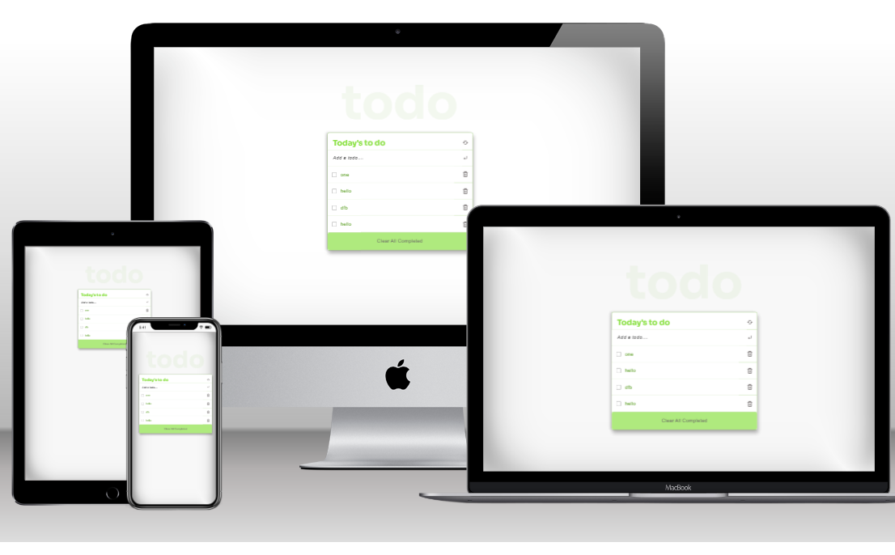

# Todo-List

> This an CRUD app built were users can create, update and delete specific day to day tasks as they wish. The app is built using webpack and served with webpack dev server.

## Built With

- HTML
- Javascript
- Css
- Webpack
- Webpack-dev server
- Jest

## To get a local copy up and running follow these simple example steps.

- Clone this repo to your machine by using Git clone: Git clone `https://github.com/DuaneDave/To-Do-List.git`
- open in your vs code terminal and run live 

### Install

- Install webhint using `npm install --save-dev hint@7.x`
- Install eslint using `npm install --save-dev eslint@7.x eslint-config-airbnb-base@14.x eslint-plugin-import@2.x babel-eslint@10.x`
- Install stylelint using `npm install --save-dev stylelint@13.x stylelint-scss@3.x stylelint-config-standard@21.x stylelint-csstree-validator@1.x`
- Install jest using `npm i --save-dev jest`
- Install jsDom using `npm install --save-dev jest-environment-jsdom-global jest-environment-jsdom`

### Run tests
To run tests on this project if you tweaked something, run the following command

- Run your test using `npm run test`
- Run webhint html checks using `npx hint .`
- Run webhint Css checks using `npx stylelint "\*_/_.{css,scss}"`
- Run webhint javascript checks using `npx eslint .`

## Authors 1

👤 **Obiebi Okiemute David**

- GitHub: [@githubhandle](https://github.com/DuaneDave)
- Twitter: [@twitterhandle](https://twitter.com/dave_duane)
- LinkedIn: [LinkedIn](https://www.linkedin.com/in/okiemute-david-obiebi-6b4a6a230/)

## Authors 2

👤 **SOULEMANOU KUNCHIEFUH BABANOU**

- GitHub: [@githubhandle](https://github.com/soulemanou-software)
- Twitter: [@twitterhandle](https://twitter.com/fastdevz1)
- LinkedIn: [LinkedIn](https://www.linkedin.com/in/soulemanou-kunchiefuh-babanou-454099196/)

## 🤝 Contributing

Contributions, issues, and feature requests are welcome!

Feel free to check the [issues page](https://github.com/DuaneDave/To-Do-List/issues).

## Show your support

Give a ⭐️ if you like this project!

## Acknowledgments

- Hat tip to anyone whose code was used
- Inspiration
- etc

## 📝 License

This project is licensed by [MIT](./LICENSE).
